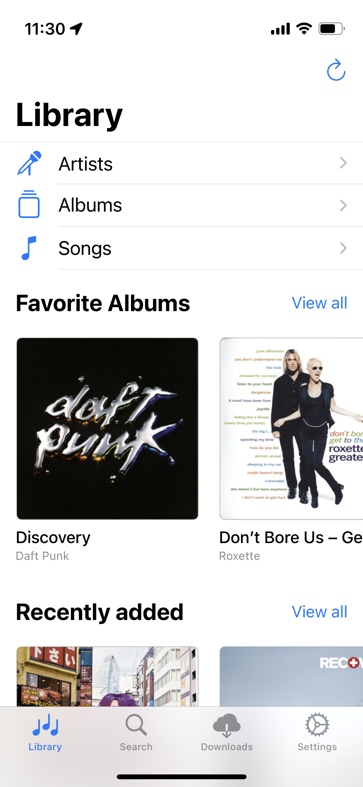
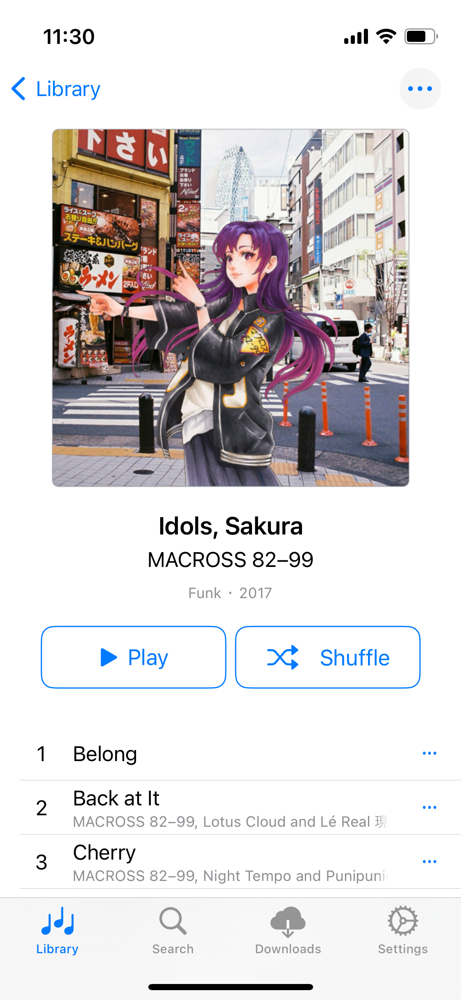
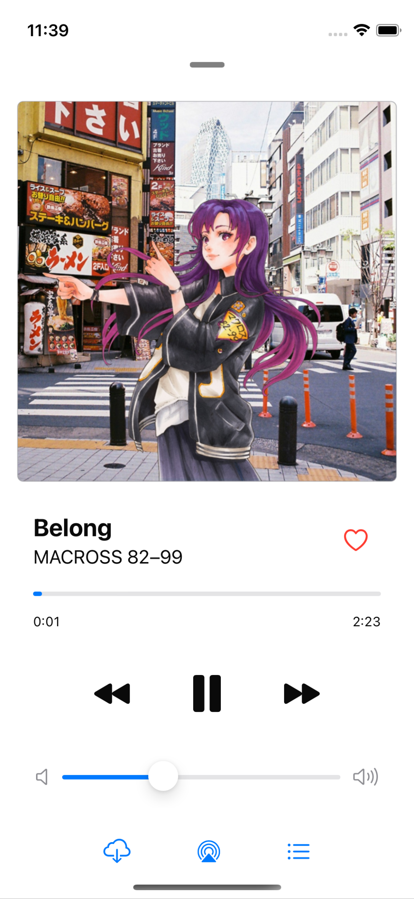
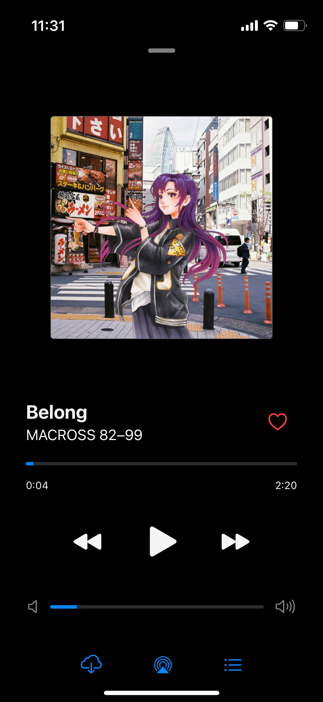

  
  

    <h1>Medúsic</h1>
    
A native iOS Jellyfin client for music playback

  

## About

Medúsic is a native Jellyfin iOS client for music playback. The project aims to implement a Jellyfin music client using native technologies on Apple platforms (Swift and SwiftUI) so that the look and feel fits right into the iOS/Apple design. The UI design and layout in general follows the Apple Music UI, but with some changes to accomodate simplicity and customizability.

## Features

The app has currently implemented these features:

- Playback (online + offline[^1]), including gapless[^2] playback
- Playback reporting to Jellyfin server
- Customizable streaming and download bitrate
- Support for light/dark color themes
- Favoriting artists/albums/songs

... and hopefully some more will be added over time.

For a list of planned features, check the repository issues with `enhancement` or `documentation` label(s).

[^1]: Technically supported, but UI/UX need improvements
[^2]: Requires properly encoded files for lossy formats - learn more [here](https://en.wikipedia.org/wiki/Gapless_playback#Format_support)

## Screenshots

Some example screenshots of the app. Might be very well outdated by the time you are looking at them. 🙂

## Development

1. Clone the repository
2. Open project in Xcode
3. Wait for xcode to restore dependencies
4. Change development team to yours

And that should be it. You should be now able to compile the app and run it in simulator or on your phone.

## Releases

For now, the only way is to compile it yourself and sideload from Xcode. Once I'm comfortable with the app state, I'll set up a TestFlight and maybe provide IPAs here.
